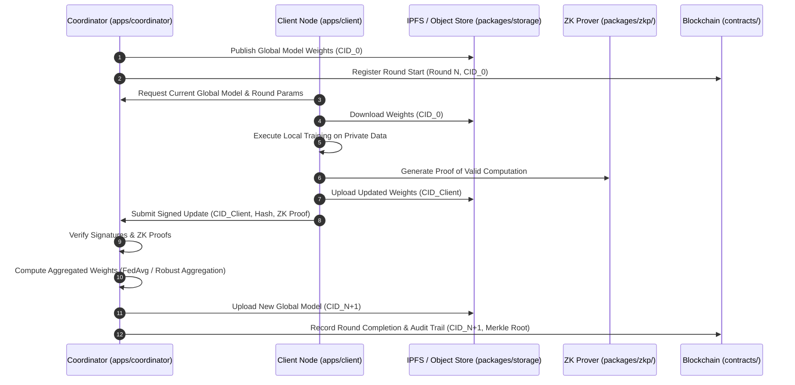

# TrustFL Monorepo Architecture & Invariants

## 1. System Overview

TrustFL provides a verifiable, privacy-preserving, and auditable Federated Learning framework. The repository is organized as a modular monorepo to maintain high cohesion between client edge execution, centralized coordination, cryptographic guarantees, decentralized storage, and distributed ledgers.

---

## 2. Directory Responsibilities

| Directory | Responsibility & Scope |
| :--- | :--- |
| `apps/coordinator/` | Orchestrates federated learning rounds, monitors participant heartbeats, receives model weight updates or diff commitments, coordinates aggregation rounds, and triggers blockchain state transitions. |
| `apps/client/` | Lightweight edge/worker runtime executing on participant nodes. Responsible for fetching global models, conducting local training on private datasets, generating cryptographic signatures and ZK proofs of training execution, and uploading encrypted/signed weight commitments. |
| `apps/api/` | FastAPI backend and API gateway service. Exposes REST/WebSocket endpoints for external clients, administrative services, and UI integrations. Handles authentication, metadata queries, and proxying status from the coordinator and storage layers. |
| `apps/dashboard/` | Next.js frontend application. Visualizes ongoing training rounds, participant nodes, performance metrics, IPFS storage integrity, and on-chain audit trails. |
| `packages/schemas/` | Core data schemas and protocol interfaces (built with Pydantic). Standardizes message interchange formats across coordinator, client, API, and storage layers. |
| `packages/crypto/` | Cryptographic primitives including ECDSA/Ed25519 digital signatures, Merkle hash trees, commitment schemes, and key management helpers. |
| `packages/blockchain/`| Abstraction and client drivers for EVM / smart contract interaction (Web3). Provides client wrappers for model registry, round progression, and participant verification contracts. |
| `packages/storage/` | Unified storage abstraction layer providing adapters for decentralized storage (IPFS / Pinata) and object stores (MinIO / AWS S3) for model weight serialization and retrieval. |
| `packages/contracts/` | Smart contracts (Solidity) implementing the on-chain audit log, client registration, round progression, and update verification state. |
| `packages/zkp/` | Independently implemented and tested zero-knowledge proof runtime. ZKP verification is an optional/deferred coordinator boundary; signed metadata and artifact hashes are the current mandatory update checks. |
| `datasets/tools/` | Tooling for synthetic dataset generation, Dirichlet non-IID data partitioning, and data format validation. |
| `infrastructure/` | Deployment definitions, Docker Compose setups for local development (IPFS node, local Ethereum testnet, MinIO), and Kubernetes/Helm charts. |
| `tests/` | Comprehensive test suites, separated into `unit/`, `integration/`, and end-to-end tests across modules. |
| `docs/` | Architecture decision records (ADRs), system specifications, protocol sequence diagrams, and API documentation. |
| `scripts/` | Shell and automation scripts for environment setup, circuit compilation, contract deployment, and developer maintenance. |

---

## 3. The Zero-Git Security & Privacy Rule

### Strict Invariant: Private Data, Secrets, and Model Artifacts NEVER Belong in Git

TrustFL enforces a strict separation between **verifiable code** and **sensitive state / artifacts**.

1. **Private Data:**
   - Client datasets, customer data, and raw/processed feature tables must **never** be placed inside version control.
   - All dataset directories (`datasets/raw`, `datasets/processed`) are blacklisted in `.gitignore`.
   - Local training must operate only on locally provisioned or dynamically partitioned data streams.

2. **Secrets & Keys:**
   - Private keys (EVM operator keys, participant asymmetric keys, TLS certificates), API tokens, and `.env` files must **never** be committed.
   - Only `.env.example` templates with non-functional placeholders are tracked.
   - Production secrets must be injected through secret managers (e.g., HashiCorp Vault, AWS Secrets Manager, Kubernetes Secrets) or encrypted environment variables.

3. **Model Weights & Artifacts:**
   - Raw model weight binaries, gradients, checkpoints (`.pt`, `.pth`, `.bin`, `.safetensors`, `.onnx`, `.npy`, etc.) must **never** be checked into Git.
   - Model weights must be uploaded to verifiable decentralized/object storage (IPFS/S3).
   - Only cryptographic identifiers, such as IPFS CIDs (`Qm...`, `bafy...`) and SHA-256 / Merkle root hashes, are committed to Git or recorded on-chain.

---

## 4. Architectural Dataflow

