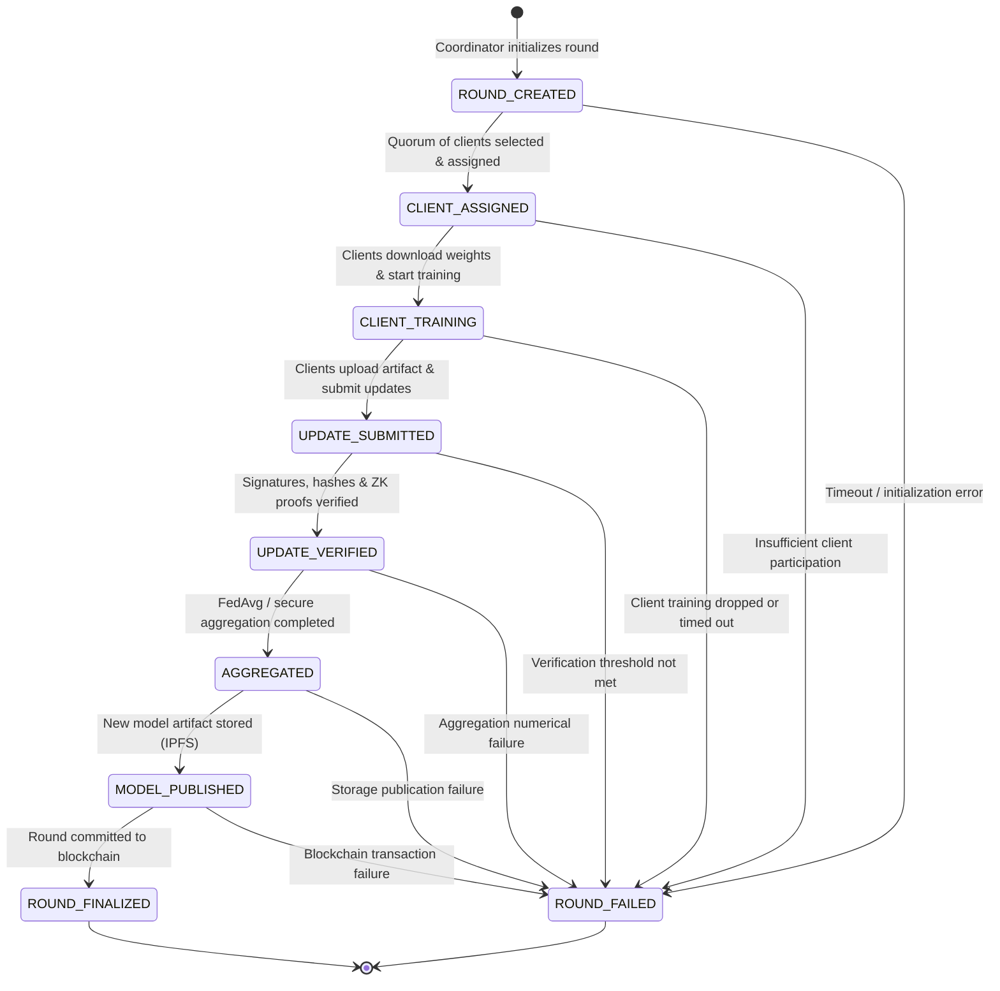

# TrustFL Shared Protocol Specification

## 1. Protocol Architecture & Invariants

The TrustFL protocol provides a cryptographically verifiable domain model for decentralized Federated Learning.
All protocol exchanges between edge workers, coordinators, API layers, and the underlying blockchain use strongly typed schemas and strictly enforced lifecycle progression.

### Core Protocol Principles
1. **Explicit Identification**: All entities have deterministic prefixes guaranteeing unambiguous types and scopes.
2. **Deterministic Lifecycle Progression**: Round states follow a strict finite-state machine (FSM). Out-of-order transitions are rejected with `InvalidStateTransitionError`.
3. **Cryptographic Grounding**: Every update and round outcome contains verifiable hashes (SHA-256), digital signatures, and optional Zero-Knowledge proof commitments.
4. **Separation of Metadata and Storage**: Raw tensors are never inlined; only immutable `ModelArtifact` references (e.g. IPFS CIDs) and hashes are exchanged.

---

## 2. Explicit Entity Identifiers

All entity identifiers follow a deterministic prefix structure:

| Identifier Type | Prefix | Format Pattern | Example | Description |
| :--- | :--- | :--- | :--- | :--- |
| **`FederationId`** | `fed_` | `^fed_[a-zA-Z0-9_\-\.]+$` | `fed_health_vision_01` | Unique scope for a federated learning consortium or task |
| **`RoundId`** | `rnd_` | `^rnd_[a-zA-Z0-9_\-\.]+$` | `rnd_round_0001` | Unique identifier for a single training round |
| **`ClientId`** | `cli_` | `^cli_[a-zA-Z0-9_\-\.]+$` | `cli_hospital_node_alpha` | Unique identifier for a client node / edge worker |
| **`ModelVersionId`** | `mod_` | `^mod_[a-zA-Z0-9_\-\.]+$` | `mod_resnet50_v1` | Version tag for global or local model checkpoints |
| **`UpdateId`** | `upd_` | `^upd_[a-zA-Z0-9_\-\.]+$` | `upd_rnd1_cli1` | Submission identifier for a client's weight update |
| **`ArtifactId`** | `art_` | `^art_[a-zA-Z0-9_\-\.]+$` | `art_checkpoint_001` | Verifiable model weight storage descriptor |

---

## 3. Schema Inventory

### 3.1. `ClientIdentity`
Represents an enrolled participant node.
- **Fields**:
  - `client_id` (`ClientId`): Node identifier (`cli_*`)
  - `federation_id` (`FederationId`): Associated federation (`fed_*`)
  - `ethereum_address` (`str`): EVM account address (`0x...`) for staking and on-chain verification
  - `public_key_hex` (`str`): Asymmetric public key for verifying signature payloads
  - `role` (`ClientRole`): `TRAINER`, `EVALUATOR`, or `AGGREGATOR`
  - `status` (`ClientStatus`): `REGISTERED`, `ACTIVE`, `IDLE`, `OFFLINE`, `SLASHED`
  - `registered_at` (`datetime`): UTC registration timestamp
  - `staked_amount_wei` (`int`): Staked security deposit in wei
  - `metadata` (`dict[str, Any]`): Node capabilities, device hardware, regional tags

### 3.2. `TrainingRound`
Coordinates the state and participants of an active or concluded round.
- **Fields**:
  - `round_id` (`RoundId`): Round identifier (`rnd_*`)
  - `federation_id` (`FederationId`): Federation reference (`fed_*`)
  - `round_number` (`int`): Monotonically increasing round sequence number
  - `state` (`RoundState`): Current lifecycle state
  - `base_model_version_id` (`ModelVersionId`): Initial model version checkpoint
  - `target_model_version_id` (`ModelVersionId | None`): Resulting aggregated model version
  - `min_clients` / `max_clients` (`int`): Quorum thresholds
  - `assigned_client_ids` (`list[ClientId]`): Clients selected for training
  - `submitted_update_ids` (`list[UpdateId]`): Updates received by coordinator
  - `verified_update_ids` (`list[UpdateId]`): Updates passing cryptographic & ZK verification
  - `aggregated_artifact` (`ModelArtifact | None`): Newly aggregated model locator
  - `evaluation_metrics` (`EvaluationMetrics | None`): Validation performance metrics
  - `blockchain_records` (`list[BlockchainRecord]`): Associated on-chain event receipts
  - `created_at` / `updated_at` (`datetime`): UTC timestamps

### 3.3. `ModelArtifact`
Verifiable locator for serialized tensors and weights.
- **Fields**:
  - `artifact_id` (`ArtifactId`): Artifact identifier (`art_*`)
  - `storage_protocol` (`StorageProtocol`): `ipfs`, `s3`, or `local`
  - `uri` (`str`): Direct storage URI (`ipfs://bafy...`, `s3://...`)
  - `sha256_hash` (`str`): 64-character hex hash of raw binary payload
  - `size_bytes` (`int`): Size in bytes
  - `merkle_root` (`str | None`): Tensor parameter Merkle root
  - `content_format` (`str`): E.g., `safetensors`, `onnx`

### 3.4. `ModelMetadata`
Architectural and parameter configuration for models.
- **Fields**:
  - `model_version_id` (`ModelVersionId`): Model version identifier (`mod_*`)
  - `federation_id` (`FederationId`): Federation reference
  - `model_name` (`str`): Human-readable model identifier
  - `architecture_family` (`str`): e.g. `resnet50`, `transformer`, `mlp`
  - `framework` (`str`): `pytorch`, `tensorflow`, or `jax`
  - `parameter_count` (`int`): Total parameter count (> 0)
  - `hyperparameters` (`dict[str, Any]`): Learning rate, optimizer configs, batch sizes
  - `created_at` (`datetime`): UTC timestamp

### 3.5. `ProofMetadata`
Zero-knowledge proof commitment descriptor.
- **Fields**:
  - `proof_id` (`str`): Proof identifier
  - `proof_type` (`ProofType`): `GROTH16`, `PLONK`, `STARK`, or `NOIR`
  - `circuit_name` (`str`): Circuit identifier (e.g. `gradient_bounds`)
  - `circuit_version` (`str`): Circuit revision string
  - `public_inputs_hash` (`str`): Poseidon or SHA-256 commitment to public inputs
  - `proof_data_hex` (`str`): Hex-encoded proof points
  - `verified` (`bool`): Verification status
  - `verification_timestamp` (`datetime | None`): Time of verification

### 3.6. `TrainingMetrics` & `EvaluationMetrics`
Operational and statistical telemetry.
- **TrainingMetrics**: `round_id`, `client_id`, `epochs_completed`, `samples_trained`, `batch_size`, `learning_rate_used`, `final_loss`, `loss_history`, `training_duration_seconds`, `compute_device`.
- **EvaluationMetrics**: `round_id`, `evaluator_client_id`, `loss`, `accuracy` (in [0, 1]), `f1_score`, `precision`, `recall`, `samples_evaluated`, `custom_metrics`.

### 3.7. `ClientUpdate`
Signed update submitted by participant nodes.
- **Fields**:
  - `update_id` (`UpdateId`): Update identifier (`upd_*`)
  - `round_id` (`RoundId`): Round reference
  - `client_id` (`ClientId`): Submitting client
  - `base_model_version_id` (`ModelVersionId`): Starting model baseline
  - `artifact` (`ModelArtifact`): Weight delta artifact locator
  - `training_metrics` (`TrainingMetrics`): Local metrics
  - `proof_metadata` (`ProofMetadata | None`): Optional ZK proof of training bounds
  - `client_signature` (`str`): Cryptographic digital signature
  - `submitted_at` (`datetime`): UTC timestamp

### 3.8. `BlockchainRecord`
On-chain transaction receipt linking the round progression to the ledger.
- **Fields**:
  - `transaction_hash` (`str`): 66-character `0x`-prefixed hex hash
  - `block_number` (`int`): Block height
  - `contract_address` (`str`): Interacted smart contract address
  - `event_type` (`BlockchainEventType`): `ROUND_INITIATED`, `CLIENT_COMMITTED`, `UPDATE_ACCEPTED`, `MODEL_AGGREGATED`, `ROUND_CONCLUDED`, `CLIENT_SLASHED`
  - `round_id` (`RoundId`): Round reference
  - `client_id` (`ClientId | None`): Participating client if applicable
  - `model_version_id` (`ModelVersionId | None`): Model version if applicable
  - `data_payload_hash` (`str`): State commitment hash
  - `timestamp` (`datetime`): UTC timestamp

---

## 4. Training Round Lifecycle State Machine

The round lifecycle is deterministic and linear, with early termination to `ROUND_FAILED` supported from any active state:

### Transition Invariants
- Skipping steps (e.g. `ROUND_CREATED` directly to `AGGREGATED` or `ROUND_FINALIZED`) raises `InvalidStateTransitionError`.
- `ROUND_FINALIZED` and `ROUND_FAILED` are terminal states; no further transitions are permitted.
- State transitions are recorded in `TrainingRound.transition_to(target_state)`.
